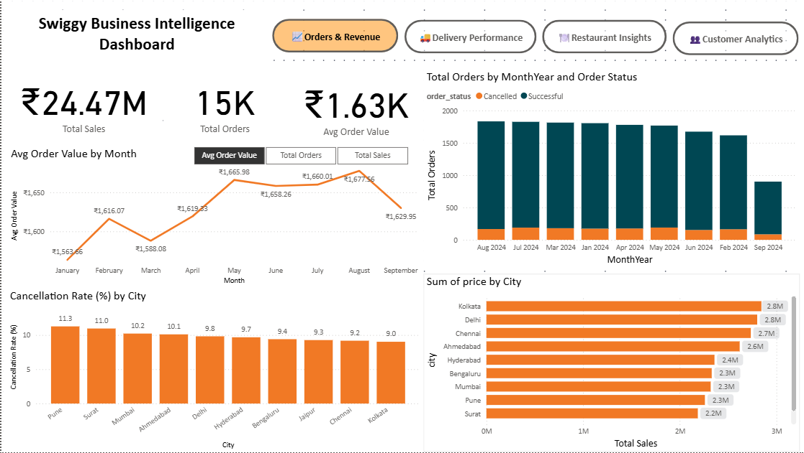
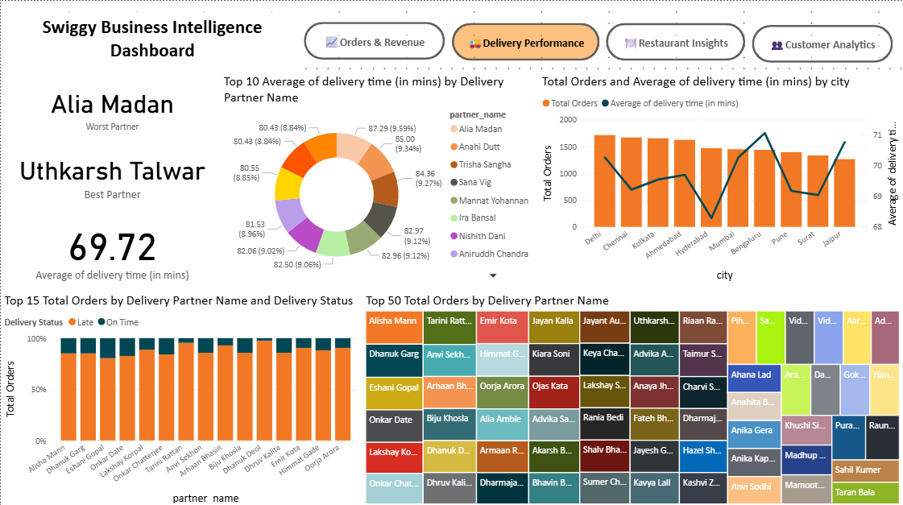
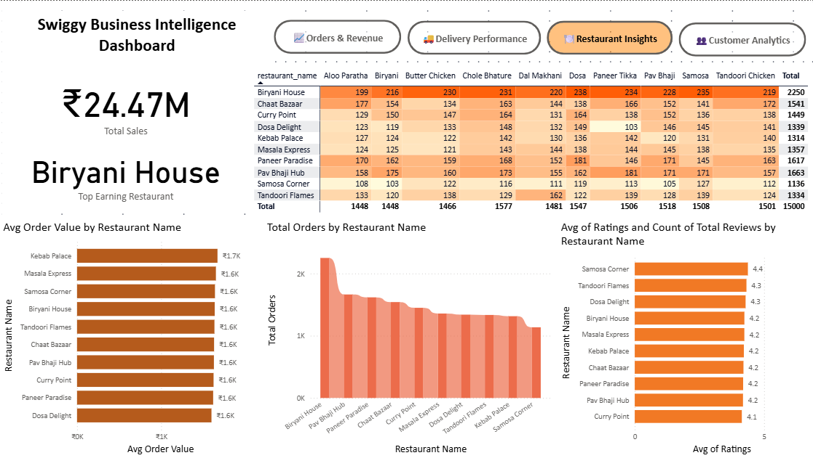
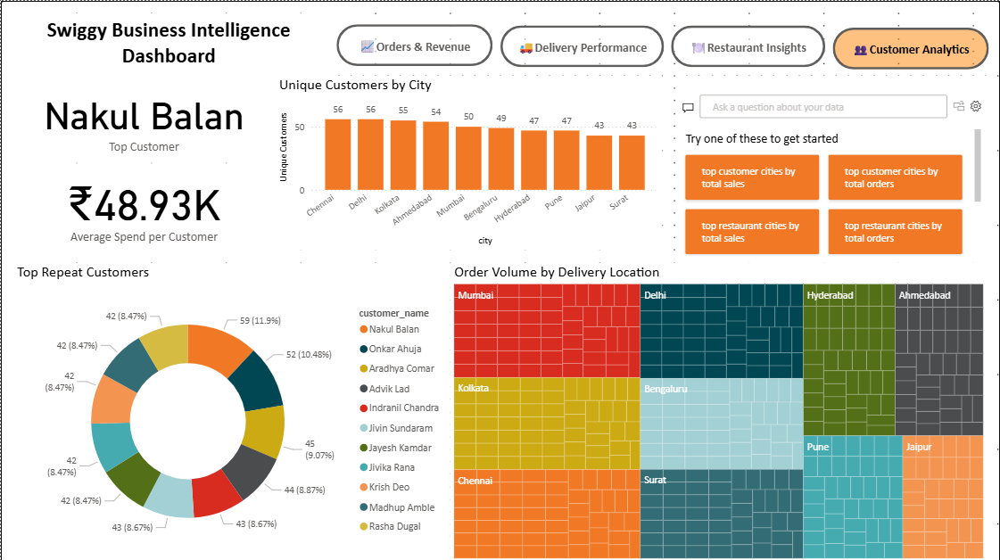

# 📦 Swiggy Power BI Dashboard

A comprehensive, multi-page Power BI dashboard analyzing Swiggy's business performance, delivery efficiency, restaurant trends, and customer loyalty.

This project was inspired by real-world food delivery operations and simulates how data analytics can drive actionable insights across multiple domains—from operations and customer experience to partner performance.

---

## 🚀 Project Summary

- 📍 Built a fully interactive Power BI dashboard using mock Swiggy dataset.
- 🔄 Data modeled across four key tables: Orders, Customers, Delivery Partners, and Restaurants.
- 🧠 Created custom DAX measures for cancellation rates, average delivery delays, revenue metrics, and customer loyalty.
- 🧩 Delivered key insights using dynamic visuals, slicers, and KPIs across 4 report pages.

---

## 📊 Dashboard Overview

### 1️⃣ Orders & Revenue Overview
- Monthly trends in order volume and average order value
- Cancellation rates across cities
- Revenue contribution by city
- Segmentation by order status

### 2️⃣ Delivery Partner Performance
- Average delivery delay per partner and by city
- On-time vs late deliveries
- Order load distribution across partners
- KPIs for best/worst performing partners

### 3️⃣ Restaurant Insights
- Top-rated restaurants and review counts
- Revenue vs rating correlation
- Most ordered dishes by restaurant
- Average order value per restaurant

### 4️⃣ Customer Analytics
- Top repeat customers
- Average spend per customer
- City-wise customer distribution
- Treemap of most frequent delivery areas

---

## 🛠️ Tools & Techniques Used
- **Power BI Desktop**
- **Data Modeling** with relationships across 4 tables
- **DAX Measures** for advanced aggregations:
  - Average Order Value
  - Cancellation Rate
  - Delivery Delay Buckets
- **Visuals Used:** Line/Bar Charts, Donut Charts, TreeMaps, Cards, Matrix, Map, Scatter Plot

---

## 📸 Screenshots

| Overview Page | Delivery Page |
|---------------|----------------|
|  |  |

| Restaurants Page | Customer Analytics |
|------------------|--------------------|
|  |  |

